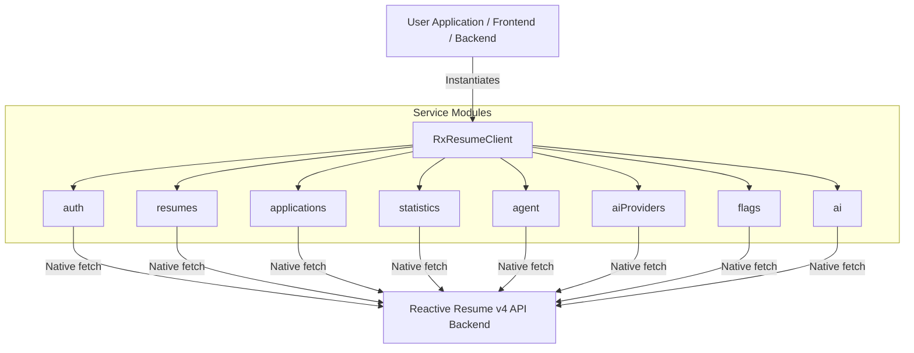

# Reactive Resume JavaScript/TypeScript SDK (`reactive-resume-api-client-js`)

[](https://www.npmjs.com/package/reactive-resume-api-client-js)
[](https://opensource.org/licenses/MIT)
[](https://www.typescriptlang.org/)
[](#)

An unofficial modern, type-safe TypeScript/JavaScript API Client (SDK) for **Reactive Resume v4**.

It is built with **zero runtime dependencies** using native web-standard `fetch`, providing seamless isomorphic support across **Node.js (18+)**, **browsers**, **Bun**, **Deno**, and edge runtimes. It includes full TypeScript definitions (`.d.ts`), dual **ESM** and **CommonJS** builds, and maps API errors into descriptive exception classes (`AuthenticationError`, `NotFoundError`, etc.).

---

## Features

- **Zero Runtime Dependencies**: Uses native `fetch` and web standards—no Axios or heavy HTTP dependencies.
- **Dual Module Support**: Seamlessly works with both ESM (`import`) and CommonJS (`require`).
- **100% Type Safety**: Comprehensive TypeScript types and interfaces for all API payloads and models.
- **Full API Coverage**:
  - 📄 **Resumes**: CRUD, import, PDF download (bytes/url), password protection, lock/duplicate, version history, and metrics.
  - 💼 **Job Applications Tracker**: CRUD, pipeline statistics, bulk import, tags.
  - 🤖 **AI Agent**: Threads, streaming messages, attachments, action rollback.
  - 🧠 **AI Tools & Providers**: Resume analysis, PDF/DOCX resume parsing, AI provider CRUD & connection test.
  - 📊 **Statistics & Flags**: Global user counts, GitHub stars, resume counters, feature flags.
  - 🔐 **Authentication**: Providers listing, account export, account deletion.
- **Python SDK Parity**: Supports standard `camelCase` methods as well as `snake_case` aliases for effortless migration from [`reactive-resume-api-client-py`](https://github.com/AtaCanYmc/reactive-resume-api-client-py).
- **Descriptive Error Handling**: HTTP error responses automatically map to specific error classes (`AuthenticationError`, `NotFoundError`, etc.).

---

## Architecture



---

## Capability Matrix

| Service Module | TypeScript Accessor | Key Methods |
| :--- | :--- | :--- |
| **Resumes** | `client.resumes` | `list`, `get`, `create`, `importResume`, `update`, `updatePut`, `delete`, `getPdfUrl`, `downloadPdf`, `tags`, `setPassword`, `removePassword`, `verifyPassword`, `getPublicResume`, `getLatestAnalysis`, `getVersions`, `duplicate`, `lock`, `getStatistics`, `getDailyStatistics` |
| **Applications** | `client.applications` | `list`, `get`, `create`, `delete`, `listTags`, `getPipelineStats`, `bulkImport` |
| **Auth** | `client.auth` | `listProviders`, `exportAccount`, `deleteAccount` |
| **Statistics** | `client.statistics` | `getUsersCount`, `getGithubStars`, `getResumesCount` |
| **Agent** | `client.agent` | `listThreads`, `getThread`, `deleteThread`, `createThread`, `getOrCreateThreadForResume`, `sendMessage`, `archiveThread`, `stopRun`, `resumeMessageStream`, `createAttachment`, `deleteAttachment`, `revertAction` |
| **AI Providers** | `client.aiProviders` (`client.ai_providers`) | `list`, `create`, `update`, `delete`, `test` |
| **AI Functions** | `client.ai` | `parsePdf`, `parseDocx`, `chat`, `analyzeResume` |
| **Feature Flags** | `client.flags` | `list` |

---

## Installation

```bash
npm install reactive-resume-api-client-js
```

Or using your favorite package manager:

```bash
# pnpm
pnpm add reactive-resume-api-client-js

# yarn
yarn add reactive-resume-api-client-js

# bun
bun add reactive-resume-api-client-js
```

---

## Quick Start

### 1. Initialize Client & Create / Import Resume

```typescript
import { RxResumeClient, type ResumeImportData } from "reactive-resume-api-client-js";

// Initialize client with either API Key or Bearer Token
const client = new RxResumeClient({
  baseUrl: "https://rxresu.me",
  apiKey: "your_api_key_here", // Or token: "your_jwt_token"
  timeout: 30000,              // optional timeout in ms (default: 30s)
});

async function main() {
  const resumeData: ResumeImportData = {
    title: "Ata Can Yaymacı - Senior Engineer",
    basics: {
      name: "Ata Can Yaymacı",
      headline: "Senior Software Engineer",
      email: "ata@example.com",
      phone: "+905555555555",
      website: "https://example.com",
    },
    sections: {},
  };

  try {
    // 1. Create / Import a new resume
    const newResume = await client.resumes.importResume(resumeData);
    console.log(`Created resume: ${newResume.name} (ID: ${newResume.id})`);

    // 2. Download compiled PDF as bytes (Uint8Array)
    const pdfBytes = await client.resumes.downloadPdf(newResume.id);
    console.log(`Downloaded PDF: ${pdfBytes.byteLength} bytes`);

    // In Node.js, you can write the PDF directly:
    // import fs from "node:fs/promises";
    // await fs.writeFile("resume.pdf", pdfBytes);

  } catch (error) {
    console.error("An error occurred:", error);
  }
}

main();
```

### 2. CommonJS Support (`require`)

```javascript
const { RxResumeClient } = require("reactive-resume-api-client-js");

const client = new RxResumeClient({
  baseUrl: "https://rxresu.me",
  apiKey: "your_api_key_here",
});

async function run() {
  const resumes = await client.resumes.list();
  for (const resume of resumes) {
    console.log(`Resume: ${resume.name} (Slug: ${resume.slug})`);
  }
}

run();
```

### 3. Job Applications Tracker, AI Agent & Statistics

```typescript
import { RxResumeClient } from "reactive-resume-api-client-js";

const client = new RxResumeClient({
  baseUrl: "https://rxresu.me",
  apiKey: "your_api_key_here",
});

// 1. Log a new job application
const app = await client.applications.create({
  company: "Google",
  position: "Staff Software Engineer",
  stage: "Interviewing",
  summary: "Completed technical interview rounds.",
});
console.log(`Application logged: ${app.company} (${app.stage})`);

// 2. Start an AI Agent thread and send a message
const thread = await client.agent.createThread();
const response = await client.agent.sendMessage(
  thread.id,
  "Suggest 3 strong bullet points for a senior backend engineer role."
);
console.log("AI Suggestion:", response);

// 3. Retrieve global metrics & feature flags
const usersCount = await client.statistics.getUsersCount();
const flags = await client.flags.list();
console.log("Total Users:", usersCount);
console.log("Flags:", flags);
```

---

## Error Handling

All HTTP errors are automatically converted into typed exception classes:

```typescript
import {
  RxResumeClient,
  AuthenticationError,
  NotFoundError,
  ReactiveResumeAPIError,
  ReactiveResumeError,
} from "reactive-resume-api-client-js";

const client = new RxResumeClient({
  baseUrl: "https://rxresu.me",
  apiKey: "invalid_key",
});

try {
  await client.resumes.list();
} catch (error) {
  if (error instanceof AuthenticationError) {
    console.error(`Authentication failed (status ${error.statusCode}):`, error.message);
  } else if (error instanceof NotFoundError) {
    console.error(`Resource not found (status ${error.statusCode}):`, error.message);
  } else if (error instanceof ReactiveResumeAPIError) {
    console.error(`API Error (status ${error.statusCode}):`, error.message);
  } else if (error instanceof ReactiveResumeError) {
    console.error("Network or connection error:", error.message);
  }
}
```

---

## Python SDK Migration Guide

If you are migrating code from [`rxresume-python`](https://github.com/AtaCanYmc/reactive-resume-api-client-py), all methods support both idiomatic JavaScript camelCase and Python snake_case aliases:

| Python Method | TypeScript (camelCase) | TypeScript (snake_case alias) |
| :--- | :--- | :--- |
| `client.resumes.import_resume(data)` | `client.resumes.importResume(data)` | `client.resumes.import_resume(data)` |
| `client.resumes.download_pdf(id)` | `client.resumes.downloadPdf(id)` | `client.resumes.download_pdf(id)` |
| `client.ai_providers.list()` | `client.aiProviders.list()` | `client.ai_providers.list()` |
| `client.applications.list_tags()` | `client.applications.listTags()` | `client.applications.list_tags()` |
| `client.agent.send_message(id, msg)` | `client.agent.sendMessage(id, msg)` | `client.agent.send_message(id, msg)` |
| `client.statistics.get_users_count()` | `client.statistics.getUsersCount()` | `client.statistics.get_users_count()` |

---

## Development & Testing

1. **Clone repository**:
   ```bash
   git clone https://github.com/AtaCanYmc/reactive-resume-api-client-js.git
   cd reactive-resume-api-client-js
   ```

2. **Install dependencies**:
   ```bash
   npm install
   ```

3. **Run tests**:
   ```bash
   npm test
   ```

4. **Typecheck**:
   ```bash
   npm run typecheck
   ```

5. **Build package**:
   ```bash
   npm run build
   ```

---

## Publishing to npm

1. Ensure all tests pass and build is up to date:
   ```bash
   npm run prepublishOnly
   ```

2. Log in to npm (if not already logged in):
   ```bash
   npm login
   ```

3. Publish to npm:
   ```bash
   npm publish --access public
   ```

---

## License

This project is licensed under the [MIT License](LICENSE).
