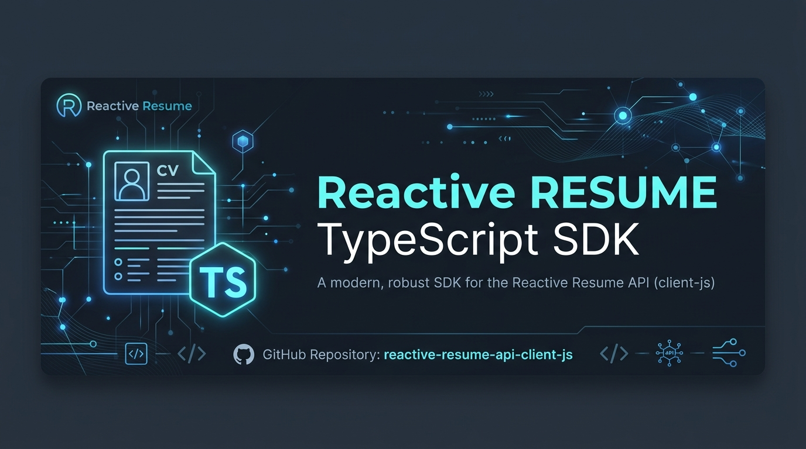
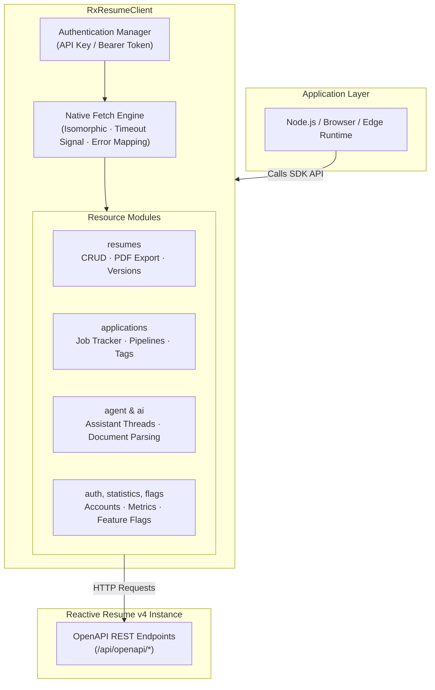

<p align="center">
  
</p>

# reactive-resume-api-client-js

[](https://www.npmjs.com/package/reactive-resume-api-client-js)
[](https://nodejs.org/)
[](https://www.typescriptlang.org/)
[](#)
[](LICENSE)
[](https://github.com/AtaCanYmc/reactive-resume-api-client-js/actions/workflows/ci.yml)

TypeScript and JavaScript SDK for the [Reactive Resume v4](https://rxresu.me) API.

Built with **zero runtime dependencies** on standard `fetch`. Works across Node.js (20+), Bun, Deno, Cloudflare Workers, and modern browsers, with dual ESM and CommonJS exports and strict TypeScript declarations.

---

## Installation

```bash
npm install reactive-resume-api-client-js
```

```bash
# Alternative package managers
pnpm add reactive-resume-api-client-js
yarn add reactive-resume-api-client-js
bun add reactive-resume-api-client-js
```

---

## Quick Start

```typescript
import { RxResumeClient } from "reactive-resume-api-client-js";

const client = new RxResumeClient({
  baseUrl: process.env.RXRESUME_BASE_URL || "https://rxresu.me",
  apiKey: process.env.RXRESUME_API_KEY,
});

async function main() {
  // 1. List user resumes
  const resumes = await client.resumes.list();
  console.log(`Found ${resumes.length} resumes.`);

  // 2. Fetch a specific resume
  const resume = await client.resumes.get(resumes[0].id);
  console.log(`Resume: ${resume.name} (Slug: ${resume.slug})`);

  // 3. Download compiled PDF bytes (Uint8Array)
  const pdfBytes = await client.resumes.downloadPdf(resume.id);
  console.log(`Downloaded ${pdfBytes.byteLength} bytes.`);
}

main().catch(console.error);
```

### CommonJS Usage

```javascript
const { RxResumeClient } = require("reactive-resume-api-client-js");

const client = new RxResumeClient({
  baseUrl: "https://rxresu.me",
  apiKey: process.env.RXRESUME_API_KEY,
});
```

---

## Interactive Web Demo

An interactive browser-based dashboard demo is included under [`demo/web/`](demo/web), allowing you to explore the SDK features live in the browser with an interactive sandbox mode (no API key required) or connected to your live Reactive Resume instance.

- **GitHub Pages**: Automatically deployed from `demo/web` via GitHub Actions
- **Run locally**:
  ```bash
  npm run preview:demo
  ```
  Then open `http://localhost:3000` in your browser.

---

## Architecture



---

## Client Configuration

`RxResumeClient` accepts the following configuration options:

```typescript
interface RxResumeClientOptions {
  baseUrl: string;               // Base URL of your Reactive Resume instance
  apiKey?: string;              // 'x-api-key' header authentication
  token?: string;               // 'Authorization: Bearer <token>' authentication
  timeout?: number;             // Request timeout in milliseconds (default: 30000)
  fetch?: typeof fetch;         // Custom fetch implementation
  headers?: Record<string, string>; // Extra headers sent with every request
}
```

### Dynamic Authentication

You can update authentication credentials at runtime without re-instantiating the client:

```typescript
// Switch to a Bearer token (removes x-api-key)
client.setToken("jwt-token-string");

// Switch to an API key (removes Bearer token)
client.setApiKey("api-key-string");
```

---

## Resource Modules

### Resumes (`client.resumes`)

Complete management of resumes, versions, access control, and statistics.

```typescript
// Listing and retrieval
const resumes = await client.resumes.list();
const resume = await client.resumes.get("resume-id");
const publicResume = await client.resumes.getPublicResume("username", "slug");

// Creation and import
const newResume = await client.resumes.create({
  title: "Software Engineer",
  basics: {
    name: "John Doe",
    email: "john@example.com",
  },
});

// Update (PATCH or PUT)
await client.resumes.update("resume-id", { name: "Updated Name" });
await client.resumes.updatePut("resume-id", fullResumeObject);

// Deletion
await client.resumes.delete("resume-id");

// Export & PDF
const pdfBytes = await client.resumes.downloadPdf("resume-id"); // Returns Uint8Array
const pdfUrl = client.resumes.getPdfUrl("resume-id");          // Direct URL string

// Password protection
await client.resumes.setPassword("resume-id", "secret");
const isValid = await client.resumes.verifyPassword("resume-id", "secret");
await client.resumes.removePassword("resume-id");

// Versions, duplication, locking
const versions = await client.resumes.getVersions("resume-id");
const duplicate = await client.resumes.duplicate("resume-id", "New Name", "new-slug");
await client.resumes.lock("resume-id", true);

// Statistics
const stats = await client.resumes.getStatistics("resume-id");
const dailyStats = await client.resumes.getDailyStatistics("resume-id", 30);
const tags = await client.resumes.tags();
```

---

### Job Applications (`client.applications`)

Track and organize job applications, pipeline status, and tags.

```typescript
// Create application entry
const app = await client.applications.create({
  company: "Acme Corp",
  position: "Senior Backend Engineer",
  stage: "Interviewing",
  summary: "Completed technical interview.",
  url: "https://acme.com/jobs/123",
});

// Query
const apps = await client.applications.list();
const appDetails = await client.applications.get(app.id);

// Pipeline statistics and tags
const stats = await client.applications.getPipelineStats();
const tags = await client.applications.listTags();

// Bulk import
await client.applications.bulkImport([
  { company: "Company A", position: "Lead Dev", stage: "Applied" },
  { company: "Company B", position: "Staff Dev", stage: "Offered" },
]);

// Delete
await client.applications.delete(app.id);
```

---

### AI Agent (`client.agent`)

Interact with Reactive Resume's AI Assistant threads and streaming actions.

```typescript
// Create a new thread
const thread = await client.agent.createThread({
  sourceResumeId: "resume-id",
});

// Send message
const response = await client.agent.sendMessage(
  thread.id,
  "Rewrite my work experience summary to highlight distributed systems."
);

// Manage attachments
await client.agent.createAttachment(
  thread.id,
  "portfolio.pdf",
  "application/pdf",
  base64Data
);

// Manage active runs
await client.agent.stopRun(thread.id);
await client.agent.archiveThread(thread.id);
await client.agent.deleteThread(thread.id);
```

---

### AI Tools & Providers (`client.ai`, `client.aiProviders`)

Parse existing documents and configure custom AI provider connections.

```typescript
// Parse PDF or DOCX resume into structured data
const parsedResume = await client.ai.parsePdf("cv.pdf", base64PdfData, "provider-id");
const parsedDocx = await client.ai.parseDocx("cv.docx", base64DocxData, "provider-id");

// Run AI analysis on an existing resume
const analysis = await client.ai.analyzeResume("resume-id", "provider-id");

// Configure AI Providers
const providers = await client.aiProviders.list();
const newProvider = await client.aiProviders.create({
  label: "Custom OpenAI",
  model: "gpt-4o",
  apiKey: process.env.OPENAI_API_KEY!,
});

// Test provider connection
const isWorking = await client.aiProviders.test(newProvider.id);
```

---

### Statistics & Platform Flags (`client.statistics`, `client.flags`)

Global platform counters and server-side feature flags.

```typescript
// Global metrics
const userCount = await client.statistics.getUsersCount();
const githubStars = await client.statistics.getGithubStars();
const resumeCount = await client.statistics.getResumesCount();

// Server feature flags
const flags = await client.flags.list();
```

---

### Authentication & Account (`client.auth`)

```typescript
const providers = await client.auth.listProviders();
const accountExport = await client.auth.exportAccount();
await client.auth.deleteAccount();
```

---

## Error Handling

All HTTP errors are mapped to distinct, typed error classes inheriting from `ReactiveResumeAPIError`:

```typescript
import {
  RxResumeClient,
  AuthenticationError,
  NotFoundError,
  ReactiveResumeAPIError,
  ReactiveResumeError,
} from "reactive-resume-api-client-js";

try {
  await client.resumes.get("invalid-id");
} catch (error) {
  if (error instanceof AuthenticationError) {
    // 401 or 403: Invalid API key or expired credentials
    console.error("Auth failed:", error.statusCode, error.message);
  } else if (error instanceof NotFoundError) {
    // 404: Resource does not exist
    console.error("Not found:", error.message);
  } else if (error instanceof ReactiveResumeAPIError) {
    // Other HTTP 4xx/5xx errors
    console.error("API Error:", error.statusCode, error.responseBody);
  } else if (error instanceof ReactiveResumeError) {
    // Network or connection failure
    console.error("Network failure:", error.message);
  }
}
```

---

## Important Notes & Best Practices

- **Zero Polyfills in Modern Environments**: This SDK relies exclusively on native `fetch`, `AbortSignal`, and `Uint8Array`. It does not import Axios or node-fetch.
- **Handling PDF Files**:
  - In **Node.js**: The downloaded PDF is a `Uint8Array`. Save it directly using `fs.promises.writeFile`:
    ```typescript
    import fs from "node:fs/promises";
    const pdfBytes = await client.resumes.downloadPdf("resume-id");
    await fs.writeFile("resume.pdf", pdfBytes);
    ```
  - In **Browser / Client-side Apps**: Convert the `Uint8Array` to a Blob URL for preview or download:
    ```typescript
    const blob = new Blob([pdfBytes], { type: "application/pdf" });
    const previewUrl = URL.createObjectURL(blob);
    window.open(previewUrl);
    ```
- **Document Parsing with AI**: When parsing PDFs or Word documents with `client.ai.parsePdf` or `client.ai.parseDocx`, supply the file contents as a base64-encoded string:
  ```typescript
  import fs from "node:fs/promises";
  const buffer = await fs.readFile("resume.pdf");
  const base64Data = buffer.toString("base64");
  const parsed = await client.ai.parsePdf("resume.pdf", base64Data, "provider-id");
  ```
- **Self-Hosted Instances**: Trailing slashes in `baseUrl` are automatically normalized (`https://rx.mycompany.com/` becomes `https://rx.mycompany.com`).
- **Custom Environments & Proxies**: If your environment requires a custom proxy agent, SSL overrides, or request logging, pass a custom `fetch` function into `new RxResumeClient({ baseUrl, fetch: customFetch })`.

---

## Frequently Asked Questions (FAQ)

<details>
<summary><b>Where do I obtain an API key?</b></summary>

Log in to your Reactive Resume instance, go to **Settings > API Keys** (or your profile settings), and create a new API Key. Pass this value as `apiKey` to `RxResumeClient`.
</details>

<details>
<summary><b>Can I authenticate using user credentials or JWT tokens?</b></summary>

Yes. If you have a Bearer token (such as a session JWT from Reactive Resume's auth endpoints), pass `token: "your-jwt-token"` in the constructor options or call `client.setToken("your-jwt-token")` at any time.
</details>

<details>
<summary><b>Does this client work in serverless and edge environments?</b></summary>

Yes. It is tested and verified for Node.js (20+), Bun, Deno, Cloudflare Workers, Next.js (Edge and Node runtimes), and standard browsers.
</details>

<details>
<summary><b>How are network errors and timeouts handled?</b></summary>

Every request respects a timeout (defaulting to 30 seconds, configurable via `timeout`). If a connection drops, times out, or DNS fails, a `ReactiveResumeError` is thrown with the message `"Network or connection error occurred: ..."`.
</details>

<details>
<summary><b>Is this 100% compatible with the Python SDK?</b></summary>

Yes. All endpoints, parameters, and return types mirror [`reactive-resume-api-client-py`](https://github.com/AtaCanYmc/reactive-resume-api-client-py). Python developers can use `snake_case` aliases directly (e.g., `client.resumes.download_pdf`).
</details>

<details>
<summary><b>How do I mock this SDK in my unit tests?</b></summary>

Because the client accepts a `fetch` override, you can mock responses without external HTTP mocking libraries:

```typescript
import { describe, it, expect, vi } from "vitest";
import { RxResumeClient } from "reactive-resume-api-client-js";

it("mocks resume fetching", async () => {
  const mockFetch = vi.fn().mockResolvedValue(
    new Response(JSON.stringify({ id: "mock-1", name: "Mock CV" }), {
      status: 200,
      headers: { "Content-Type": "application/json" },
    })
  );

  const client = new RxResumeClient({
    baseUrl: "https://rxresu.me",
    apiKey: "test",
    fetch: mockFetch,
  });

  const resume = await client.resumes.get("mock-1");
  expect(resume.name).toBe("Mock CV");
});
```
</details>

---

## Contributing & Community

Contributions, feature requests, and issues are warmly welcomed!

- **Contributing Guide**: Check out [CONTRIBUTING.md](CONTRIBUTING.md) for local setup, development commands, and PR guidelines.
- **Security Inquiries**: Review our security and vulnerability disclosure policy in [SECURITY.md](SECURITY.md).
- **Code of Conduct**: Please follow our [Code of Conduct](CODE_OF_CONDUCT.md) in all community interactions.

---

## License

[MIT](LICENSE) &copy; [Ata Can Yaymacı](https://github.com/AtaCanYmc)
